# linkindex
A macro that creates a link to any location on Excel and also creates a link on the log file.
## What is this for?
We write down various things in EXCEL, but after a while, we sometimes forget which EXCEL we wrote them down. If you manage your EXCEL memos with this macro, the date will also be saved at the same time, making it easier to remember in which EXCEL you took the memo.
## Preparing to use linkindex
1. Create a new book with excel.

2. Save it as "C:\Users\XXXX\AppData\Roaming\Microsoft\Excel\XLSTART\PERSONAL.XLSB". (Change XXXX to match your username.)
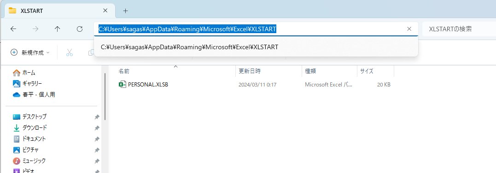

3. Download "linkindex.bas" to your PC.

4. Open Visual Basic and import "linkindex.bas".
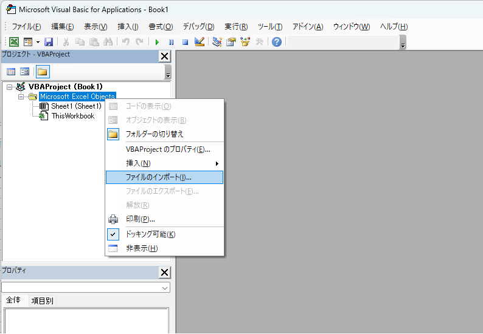

5. Create an excel workbook for history and place it in any directory.
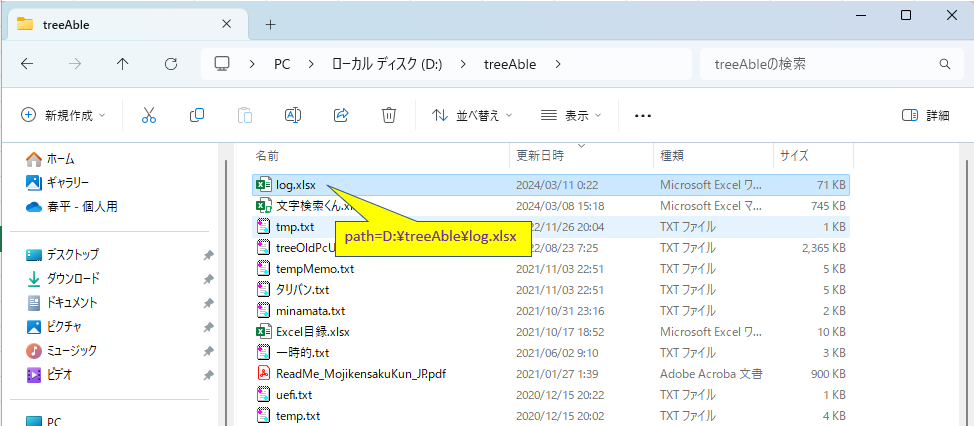

6. The history excel workbook must have a sheet named "latest".
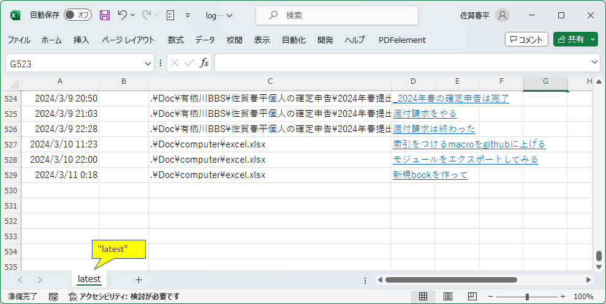

7. A sheet called "settings" must exist in "PERSONAL.XLSB". A CELL with the name "LogFilePath" must exist in the "settings" sheet. Set the path of the excel workbook for history in the CELL with the name "LogFilePath".
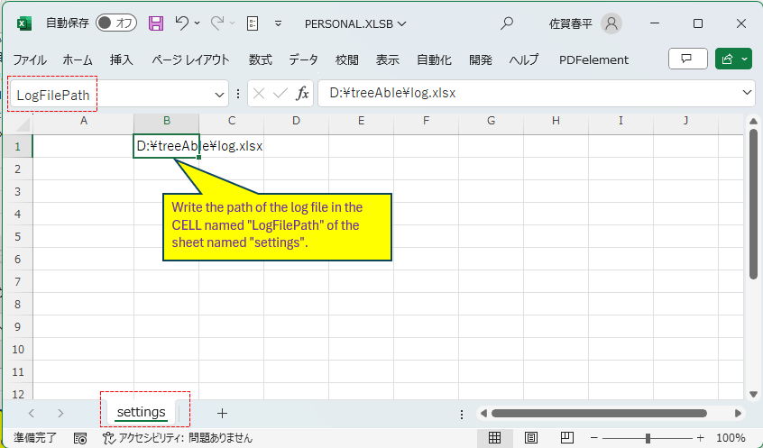

8. Assign the NameLinkLog sub procedure of "linkindex.bas" to a shortcut key.
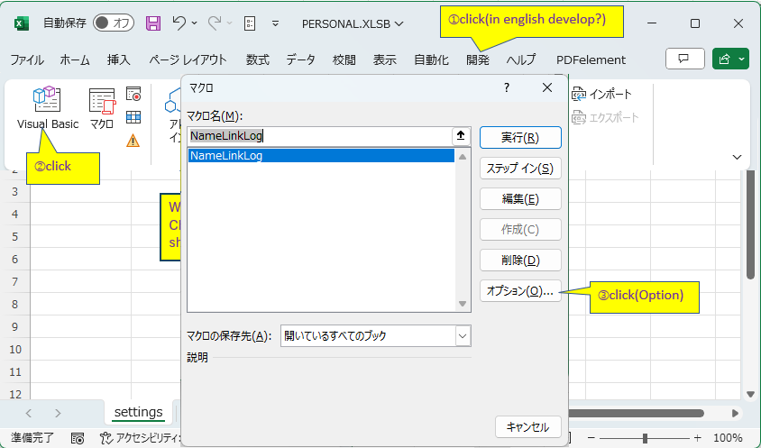
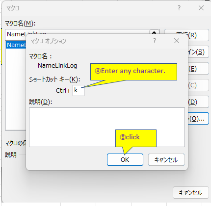
## How to use linkindex

9. The Excel workbook managed by linkindex must have a sheet named "index".
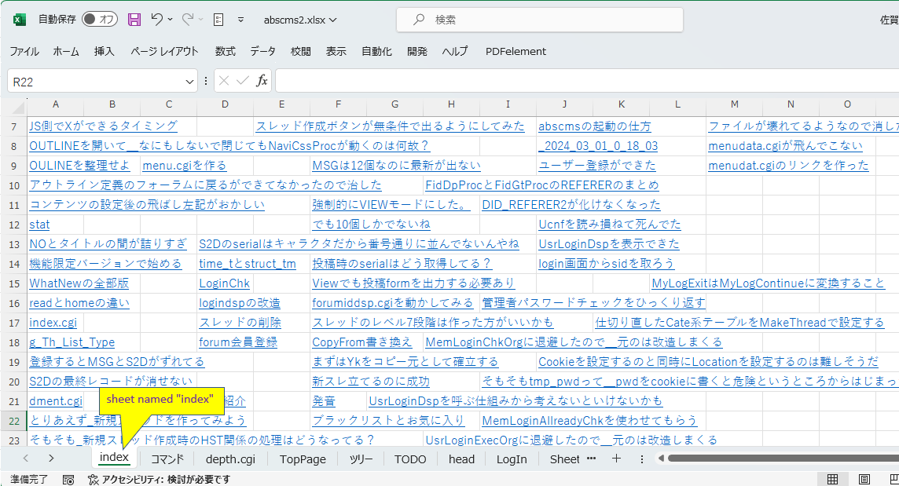

10. In the Excel workbook managed by linkindex, place the cursor on the CELL you want to add a heading to and press the shortcut key set in step 8.
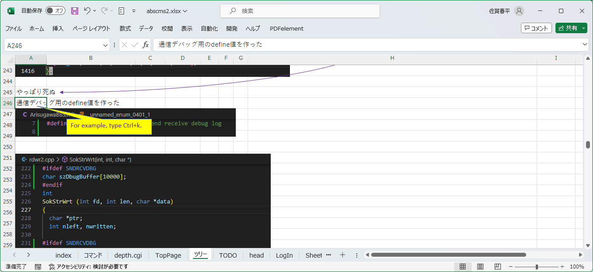

11. The index sheet will then be displayed, so click anywhere and the index will be entered there.
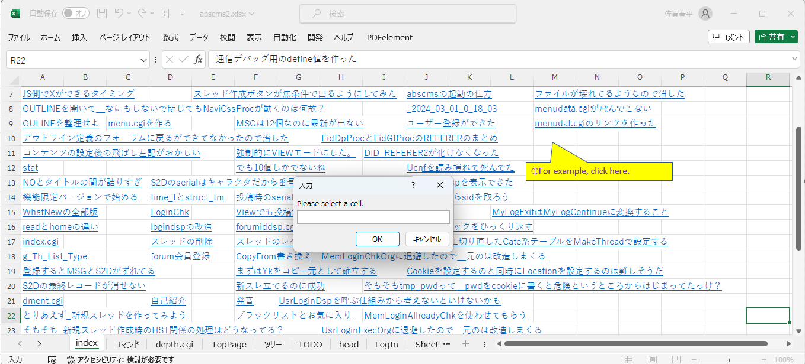
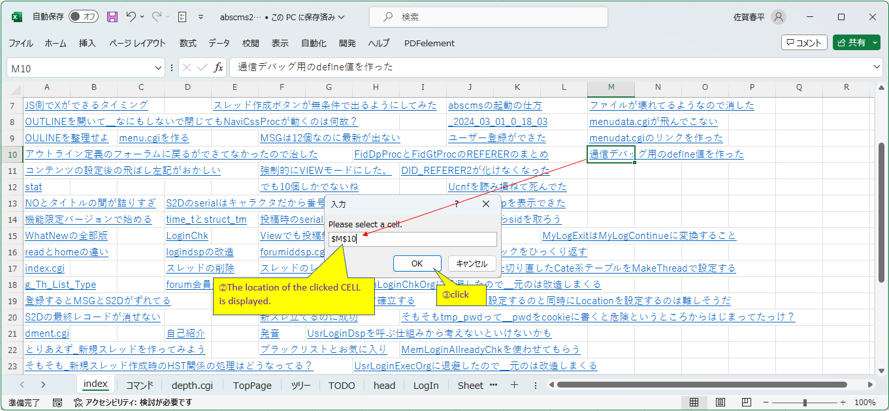

12. The display returns to the CELL with heading in the Excel workbook managed by linkindex. At this time, this book has already been saved.
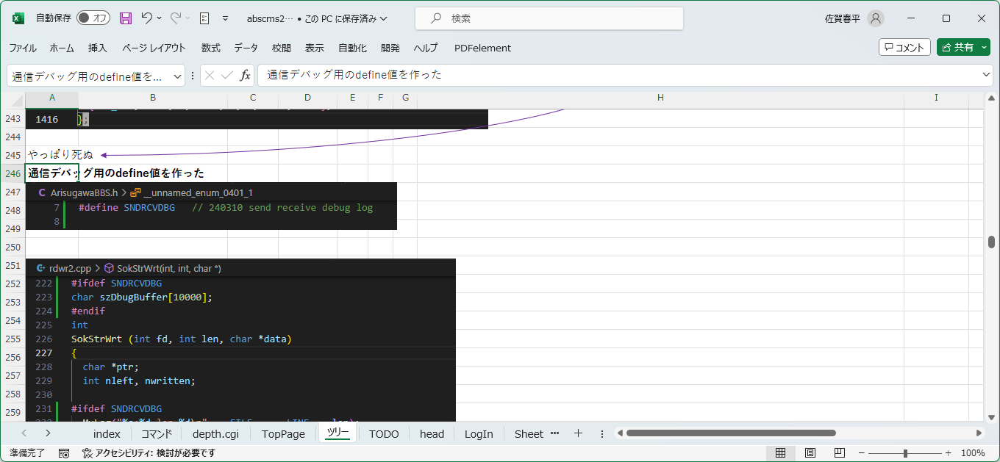

13. Check history excel workbook.
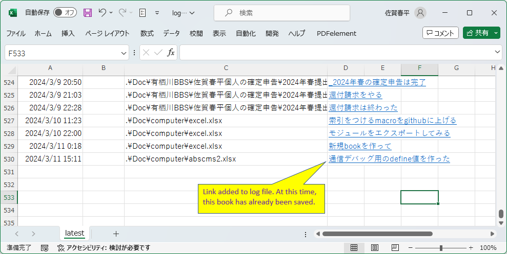

14. What happens if you select a blank CELL and press Ctrl+k?
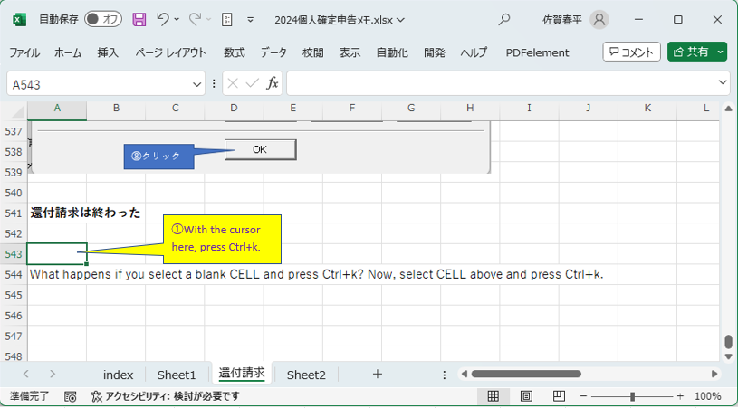
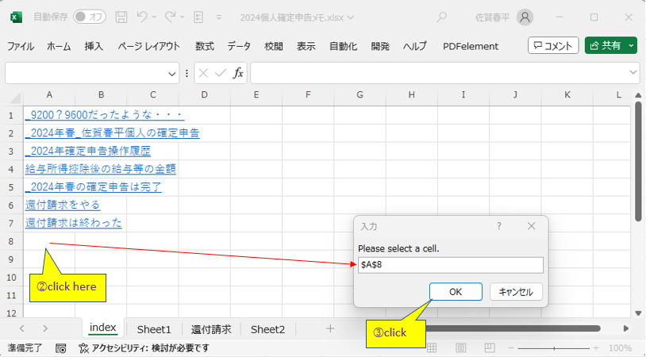
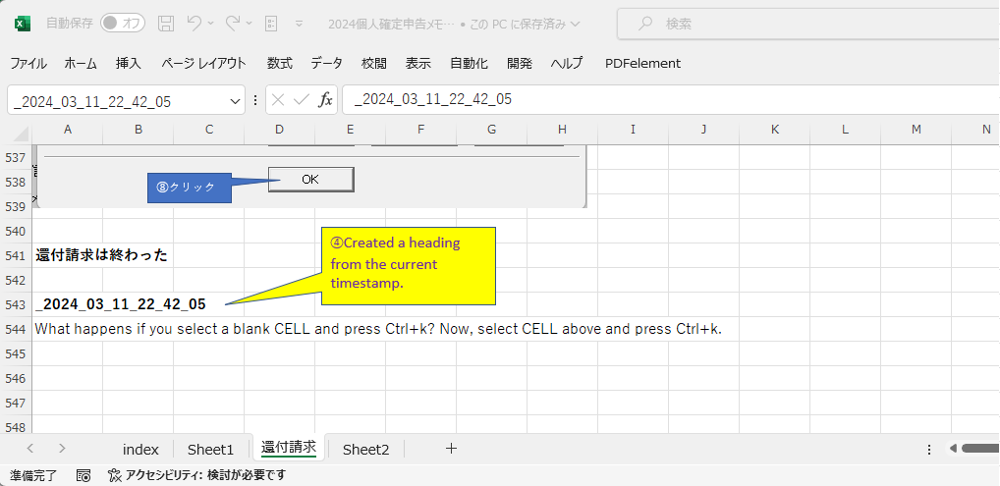
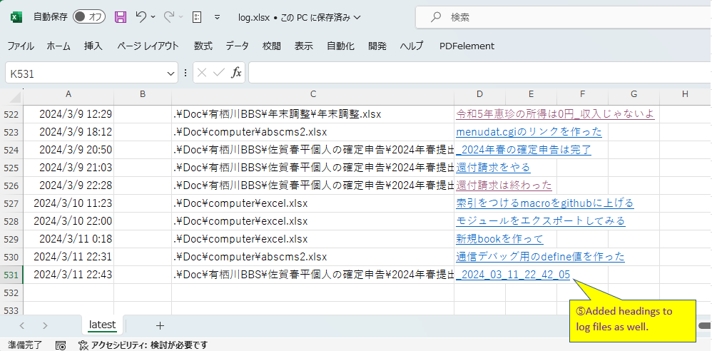

### NOTE:
- You cannot create a link to a character string that is invalid as an EXCEL link. For example, it starts with a number. Including "," etc.
- Also, if the sheet name containing the string you want to link contains spaces, it will not work correctly.
- The EXCEL workbook managed by linkindex cannot be placed in a hierarchy above the folder where the history Excel workbook is located.
